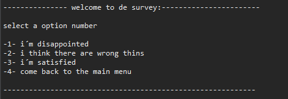
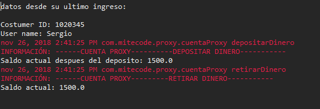

# store

For this practice, we have made the management of an online store menu. For this program, we have used a master class (menu) and two secondary (costumer and books).
In the main class, we found the body of the program which implemented it with a switch which it call's various functions.
 Functions:
 
 
 		 try {
			while(respuesta!=4) {
			System.out.println("\twelcome to the main menu: select one option :)");
			
					System.out.println(" -1- sing in");
					System.out.println(" -2- search a book");
					System.out.println(" -3- buy books"); 
					System.out.println(" -4- sing out");
					
					System.out.println("select a option number");
					respuesta = respuesta1.nextInt();
					
					menu j = new menu();
					
					switch(respuesta) {
					case 1:
						
						j.sing_in();
						break;
						
					case 2: 
						
						 j.search();
						 break;
			
					case 3: 
						
						 j.buy_books();
						break;
					case 4: 
						System.out.println("\tthanks come back soon");
						break;

					}
					
			}
			
			}	catch (Exception e)	{
				System.out.println("\tTHIS OPERATION IS UNVIABLE");

			}
 ´´´
 
 
 
 
 
1.	Sing_in, this first option register new users and administrator can view the list of users.

2.	Search seek all kinds of books, or by gender either visualizing the entire list. 

3.	Buy_books this option the user can buy books, perform currency exchange option and display the list of purchase.   

To save both, users and books we have employed lists which we call to show items. 
Another feature to be highlighted in the program is the use of files, our program creates a text file with the name, user name and email of all new registered users on the desktop.

´´´
		
			String j = "\r\n";
			String s = "";
			String a = "";
	try {
				
		//we define the place of the file in our pc
				
				File f = new File("C:\\Users\\alvar\\Desktop/users.txt");
				
				
				if(f.exists()) {
					
					f.delete();
					f.createNewFile();
					
				}
	
				FileWriter f2 = new FileWriter(f, true);

				for(int i = 0;i<costumer_list.size();i++) {
					
					

					f2.write("name :" + costumer_list.get(i).getName() + " || user name :" +       costumer_list.get(i).getUser_name()+" || email :" + costumer_list.get(i).getEmail() );
					f2.write(s);
					f2.write(j);
					f2.write(a);
				}
				f2.close();

			} catch (IOException e) {
			
				e.printStackTrace();
			}
´´´

For the main menu we have use a “try catch” for the exceptions control.

